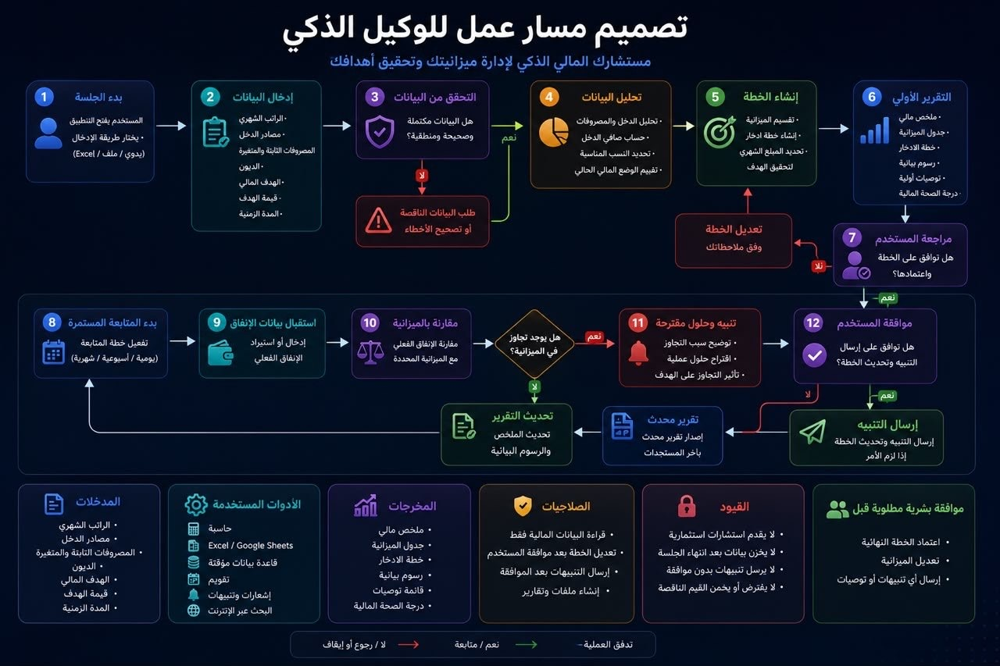
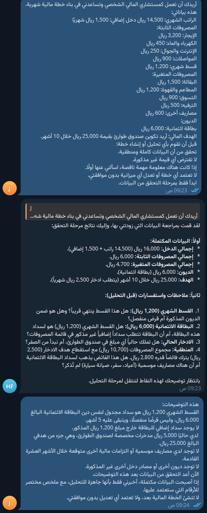
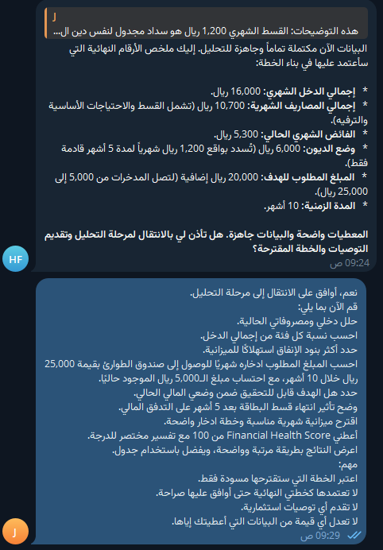
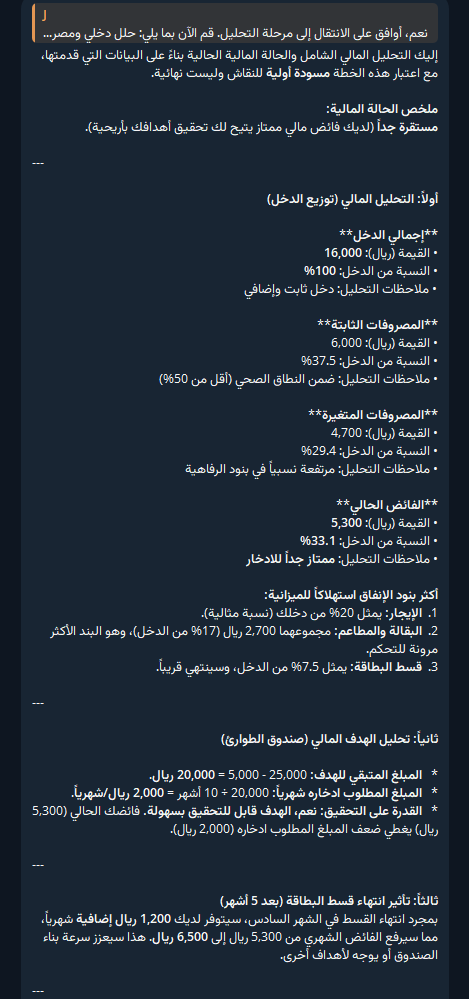
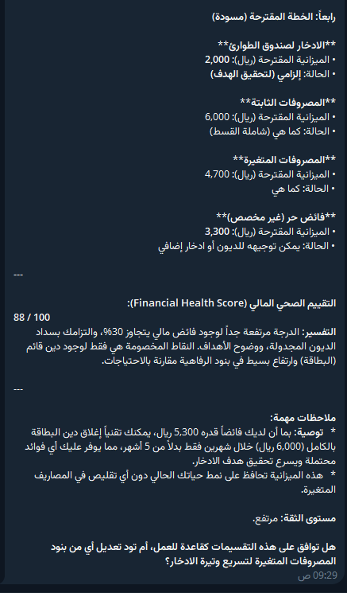
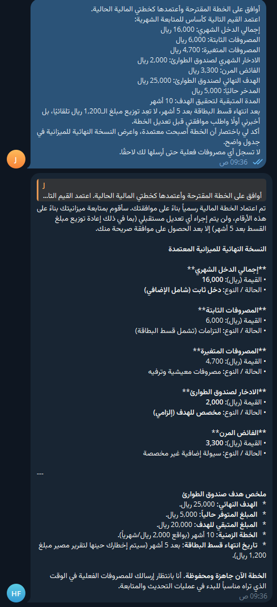
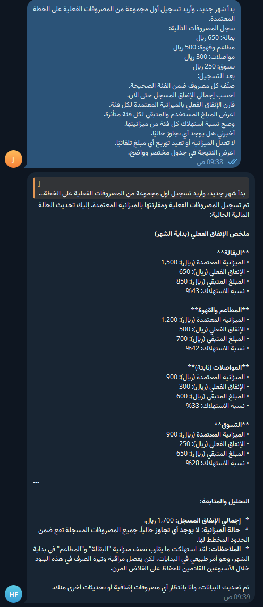
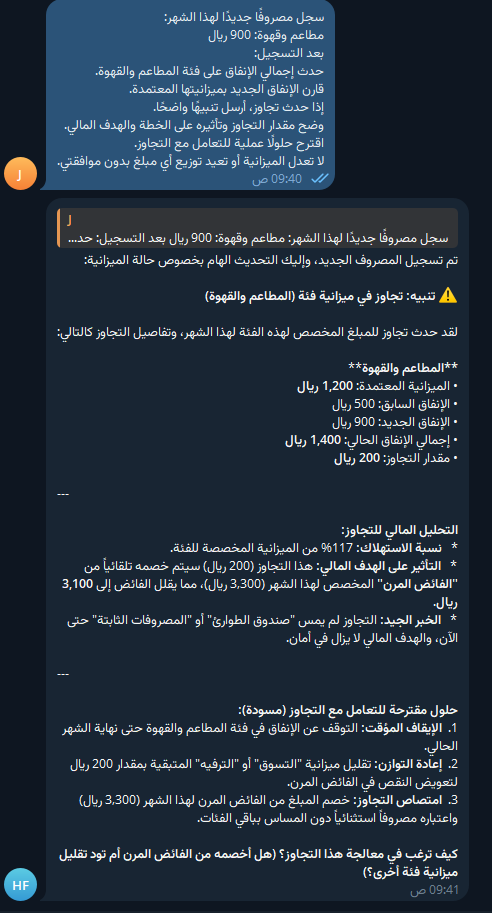
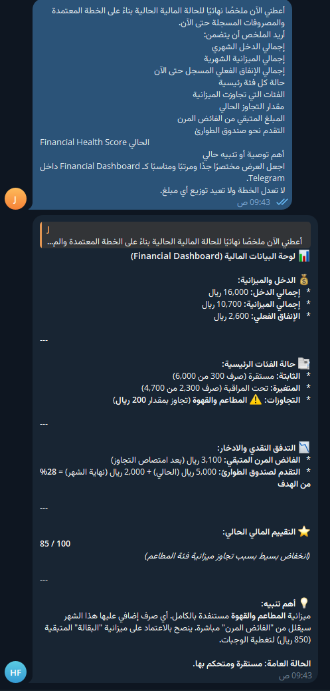

# CashOrbit — AI Financial Advisor Agent

An AI-powered personal financial advisor agent built with **Hermes**, running on a **local LLM** and connected to **Telegram**.

The agent validates financial inputs, analyzes spending, builds a savings plan, tracks real expenses, detects overspending, and keeps the user in control through explicit approval before important plan changes.

---

## HTML Preview

Browse the visual walkthrough in [preview.html](preview.html). Download the repository and open this file in a browser to view the HTML page with its images.

## Agent Workflow

The diagram below shows the full lifecycle of the agent — from collecting financial data to validating inputs, generating a plan, tracking spending, detecting budget overruns, and updating the financial report.

---

# Workflow in Action

The screenshots below show the same workflow being executed inside Telegram, in the actual order of the demo.

## 1. Input Validation & Missing-Data Detection

The agent reviews the user’s financial data before creating a plan. It identifies missing or unclear information and asks follow-up questions instead of making assumptions.

---

## 2. Readiness Check Before Analysis

After the missing details are provided, the agent confirms the key financial figures and waits for explicit approval before moving to the analysis stage.

---

## 3. Financial Analysis

The agent analyzes income, fixed and variable expenses, monthly surplus, savings requirements, and the feasibility of reaching the emergency-fund goal within the requested timeframe.

---

## 4. Proposed Budget Plan & Financial Health Score

A draft monthly plan is generated with savings allocation, spending structure, and a **Financial Health Score**. The plan remains a draft until the user approves it.

---

## 5. Human-in-the-Loop Plan Approval

The user explicitly approves the proposed financial plan. The agent then treats it as the active plan while preserving the rule that future adjustments require user approval.

---

## 6. Expense Tracking & Budget Monitoring

Actual monthly expenses are recorded and categorized. The agent compares real spending against the approved budget and shows the amount used, remaining balance, and category utilization.

---

## 7. Overspending Detection & Smart Alert

When spending exceeds a category limit, the agent detects the overrun, calculates the impact, explains the risk to the financial plan, and suggests corrective actions — without changing the plan automatically.

---

## 8. Financial Dashboard & Updated Status

The final dashboard summarizes income, budget usage, actual spending, remaining flexible cash, emergency-fund progress, overspending status, and the updated **Financial Health Score**.

---

## Core Capabilities Demonstrated

- Financial input validation
- Missing-data detection
- Income and expense analysis
- Savings-goal planning
- Personalized monthly budgeting
- Financial Health Score
- Human approval before plan activation or modification
- Expense categorization and tracking
- Budget comparison
- Overspending alerts
- Financial dashboard summaries
- Telegram-based interaction
- Local AI model execution

---

## Safety & Guardrails

The agent is designed to:

- avoid guessing missing financial values,
- avoid investment advice,
- avoid changing an approved plan without user consent,
- require user approval for important financial adjustments,
- explain the effect of overspending before recommending corrective actions.

---

## Tech Stack

- Hermes Agent
- Local LLM
- Telegram Bot Integration
- Local inference environment
- Financial analysis and tracking tools

---

## Repository Contents

- `README.md`: project overview and illustrated demo.
- `preview.html`: standalone visual walkthrough.
- Numbered screenshot files: workflow diagram and Telegram demo.
- `SOUL.md`: previously published agent personality instructions.

